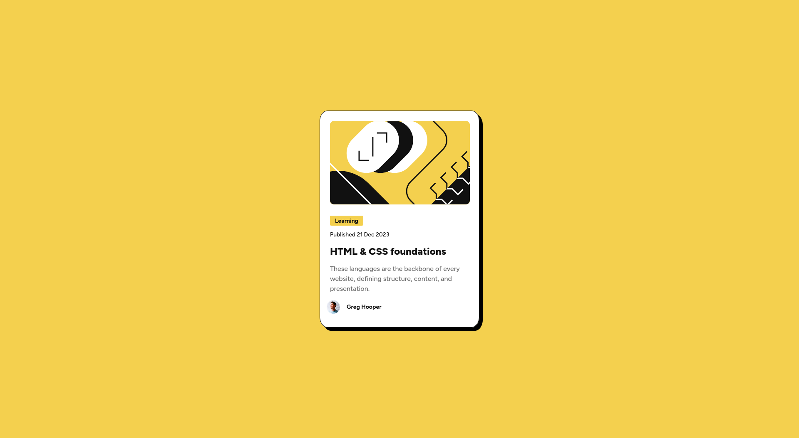

# Frontend Mentor - Blog preview card solution

This is a solution to the [Blog preview card challenge on Frontend Mentor](https://www.frontendmentor.io/challenges/blog-preview-card-ckPaj01IcS). Frontend Mentor challenges help you improve your coding skills by building realistic projects. 

## Table of contents

- [Overview](#overview)
  - [The challenge](#the-challenge)
  - [Screenshot](#screenshot)
  - [Links](#links)
- [My process](#my-process)
  - [Built with](#built-with)
  - [What I learned](#what-i-learned)
  - [Continued development](#continued-development)
  - [Useful resources](#useful-resources)
- [Author](#author)
- [Acknowledgments](#acknowledgments)

**Note: Delete this note and update the table of contents based on what sections you keep.**

## Overview

### The challenge

Users should be able to:

- See hover and focus states for all interactive elements on the page

### Screenshot

### Links

- Solution URL: [https://github.com/vanhog/frontend-mentor-blog-preview-card](https://github.com/vanhog/frontend-mentor-blog-preview-card)
- Live Site URL: [https://frontend-mentor-blog-preview-vanhog.netlify.app/](https://frontend-mentor-blog-preview-vanhog.netlify.app/)

## My process

### Built with

- Semantic HTML5 markup
- CSS custom properties
- Flexbox

### What I learned

The most important thing I’ve learned is: plan first, code second. It was a great experience to examine the design system first, take notes on the screenshots, and create a **sketch** as part of my HTML planning.

### Continued development

Don't code before you have a plan!

### Useful resources
https://stackoverflow.com/questions/982054/how-to-center-an-element-in-the-middle-of-the-browser-window

- [Stack overflow 982054](https://stackoverflow.com/questions/982054/how-to-center-an-element-in-the-middle-of-the-browser-window) - This helped me for finding a better way to center content.

## Author

- Website - [Dieter H. Hoogestraat (Dee)](https://www.hoogestraat.com)
- Frontend Mentor - [@vanhog](https://www.frontendmentor.io/profile/vanhog)

## Acknowledgments

This is where you can give a hat tip to anyone who helped you out on this project. Perhaps you worked in a team or got some inspiration from someone else's solution. This is the perfect place to give them some credit.

Thanks to [Caner](https://stackoverflow.com/users/448625/caner) who wrote that stackoverflow answere mentioned above that helped me so much.

